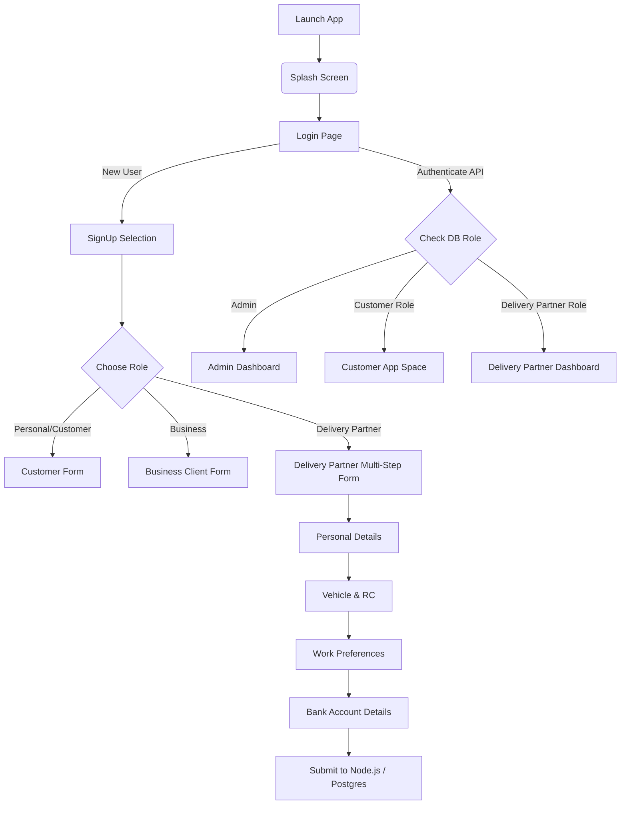

# RapidX - Project Documentation and Details Report

## 1. Project Overview
**RapidX** is a comprehensive, on-demand parcel delivery and business logistics management platform built to cater to regular customers, business clients, and delivery partners. The platform facilitates order creations (parcel delivery), tracking, billing, payments, settlements, and extensive delivery partner management. 

The application is structured into two main codebases:
1. **Frontend**: A mobile application built with **Flutter**.
2. **Backend**: A RESTful API server built with **Node.js, Express, and PostgreSQL**.

---

## 2. Tech Stack

### Frontend (Flutter Mobile App)
- **Framework:** Flutter (SDK `^3.9.2`)
- **State Management:** 
  - `flutter_riverpod` (`^2.6.1`) for Delivery Partner flows.
  - `provider` (`^6.1.5+1`) for Customer flows.
- **UI & Styling:** `flutter_screenutil` (responsive sizing), `google_fonts` (typography).
- **Animations:** `lottie`, `dotlottie_loader` (for smooth and interactive motion design).
- **Other utilities:** `image_picker` (for documents & profile photos), `http` (API integration), `shared_preferences` (local auth token storage).

### Backend (Node.js API)
- **Framework:** Express.js (`^5.2.1`)
- **Database:** PostgreSQL (`pg ^8.17.1`)
- **Authentication:** `jsonwebtoken` (JWT) & `bcrypt` (password hashing)
- **Middleware:** `cors`, `body-parser`, `dotenv`

---

## 3. UI/UX Design & Components
The application emphasizes a **modern, clean, and responsive** mobile-first user interface.
- **Design Themes**: Consistent theming is used (`DPTheme`, `DPColors`) to ensure uniformity across the app. 
- **Typography**: Extensive use of Google Fonts (primarily `Baloo 2` and `Inter`) for clean, engaging textual headers and content.
- **Micro-Animations**: Uses dynamic Lottie animations in the Splash page and Home page sliders to "wow" the user.
- **Bottom Sheets**: Comprehensive use of Bottom Sheets across the app instead of full-page navigation for:
  - Bank Account details input.
  - Document uploads (RC book, License, etc.).
  - Work Preferences.
  - Help, Support, Privacy Policy.
- **Modularity**: UI is heavily component-based with reusable custom input fields and action buttons.

---

## 4. Folder Structure Architecture

```text
c:\Workspace\New_rapidX\
│
├── rapidx_mobile/ (Frontend Application)
│   ├── android/
│   ├── ios/
│   ├── lib/
│   │   ├── Admin/             # Admin Module (Dashboard, Roles mapping)
│   │   ├── Common/            # Common UI (Login, shared components)
│   │   ├── Customer/          # Customer Module (Home, Orders, Profile)
│   │   ├── deliveyPartner/    # Delivery Partner Module
│   │   │   ├── mainApp/       # Navigation, Orders, Profile UI
│   │   │   ├── theme/         # Color palettes and text themes
│   │   │   └── deliveryPartnerSignUp.dart 
│   │   ├── providers/         # State Management logic (Riverpod & Provider)
│   │   ├── main.dart          # Entry point, ProviderScope initialization
│   │   └── splashPage.dart    # App initial load animation
│   └── pubspec.yaml
│
└── rapidx_backend/ (Backend API)
    ├── server/
    │   ├── src/
    │   │   ├── config/        # Database (pool) configuration
    │   │   ├── controllers/   # Request handlers (e.g., userController.js)
    │   │   ├── routes/        # Express router endpoints
    │   │   ├── services/      # Business logic and SQL Queries (userService.js)
    │   │   └── server.js      # Express initialization
    │   ├── .env               # Environment attributes
    │   └── package.json       # Node dependencies
    └── client/                # React/Web Dashboard (if applicable)
```

---

## 5. State Management Approach

The application utilizes a **hybrid state management strategy**:

1. **Riverpod (`flutter_riverpod`)**:
   Recently migrated, the Delivery Partner section uses Riverpod for superior immutability and testability.
   - **Entity State:** Uses an immutable data class (`DeliveryPartnerState`) containing fields like name, phone, bank info, docs, etc., with a `copyWith` constructor.
   - **Notifier:** `DeliveryPartnerNotifier` extends `StateNotifier<DeliveryPartnerState>`.
   - **Consumer Elements:** Custom UI uses `ConsumerWidget` or `ConsumerStatefulWidget` calling `ref.read` (for mutations) and `ref.watch` (for UI rebuilds).

2. **Provider (`provider`)**:
   The core customer section legacy utilizes `ChangeNotifierProvider`.
   - Modifies states directly via getters/setters and triggers `notifyListeners()`.
   - Accessed using `Provider.of<UserDataProvider>(context)`.

---

## 6. Entity-Relationship Diagram (Database)

Below is an overview of the core PostgreSQL architecture used in the backend.

```mermaid
erDiagram
    USERS {
        int user_id PK
        int role_id FK (roles_master)
        int business_id FK (business_clients)
        string email
        string phone
        string password "Hashed"
        boolean is_banned
        string first_name
        string last_name
    }
    
    BUSINESS_CLIENTS {
        int business_id PK
        int account_admin_id FK (users)
        string company_name
        int business_type_id
        string reg_no
        string business_phone
        int account_status_id FK (value_master)
    }

    DELIVERY_PARTNER {
        int delivery_partner_id PK "Foreign Key to USERS"
        date birth_date
        string profile_picture
        string license_number
        string vehicle_number
        int working_type_id
        string time_slot
        boolean is_verified
    }

    ADDRESSES {
        int address_id PK
        int user_id FK (users)
        int business_id FK (business_clients)
        string address
        string city
        string state
        string pincode
        boolean is_default_address
    }

    ORDERS {
        int order_id PK
        int sender_id FK (users)
        string sender_name
        string receiver_name
        string receiver_address
        float order_amount
        int delivery_status_id
        boolean is_complete
    }

    PARCELS {
        int parcel_id PK
        int order_id FK (orders)
        int parcel_type_id
        int parcel_size_id
    }

    ROLES_MASTER ||--o{ USERS : ""
    USERS ||--o{ ADDRESSES : ""
    BUSINESS_CLIENTS ||--o{ ADDRESSES : ""
    USERS ||--o{ ORDERS : "Sender"
    ORDERS ||--o{ PARCELS : "Contains"
    USERS ||--|{ DELIVERY_PARTNER : "extends"
```

---

## 7. Application Flow Architecture

### 7.1. Login & Registration Flow


### 7.2. Order Creation Flow (Customer)
1. **Initiation**: User opens Customer Dashboard.
2. **Pickup/Drop Data**: User provides Sender and Receiver details (leveraging saved DB addresses if applicable).
3. **Parcel Specs**: Application requests Package Size and Parcel Type.
4. **Billing Summary**: Calculates totals, taxes.
5. **Backend Processing**: Frontend executes `POST /api/users/orders` containing the `Bearer Token`.
6. **Execution**: Backend inserts into `ORDERS` and dynamically maps multiple items into `PARCELS`.

### 7.3. Order Execution Flow (Delivery Partner)
1. **Acceptance**: Partner sees incoming assignment in 'Today Summary'.
2. **Status Iteration**: Partner utilizes Active Order Stepper to progress status.
   - `Assigned` -> `Picked Up` -> `In Transit` -> `Delivered`.
3. **Geo UI**: Features inline quick action buttons for "Call Receiver" or "Map Navigation" directly from the order card.

---

## 8. Development & Tooling Commands
- **Flutter Runner**: `flutter run`
- **Dependencies Update**: `flutter pub get`
- **Linter Analysis**: `flutter analyze`
- **Node Backend Server**: `npm run dev` (utilizes `nodemon`)
