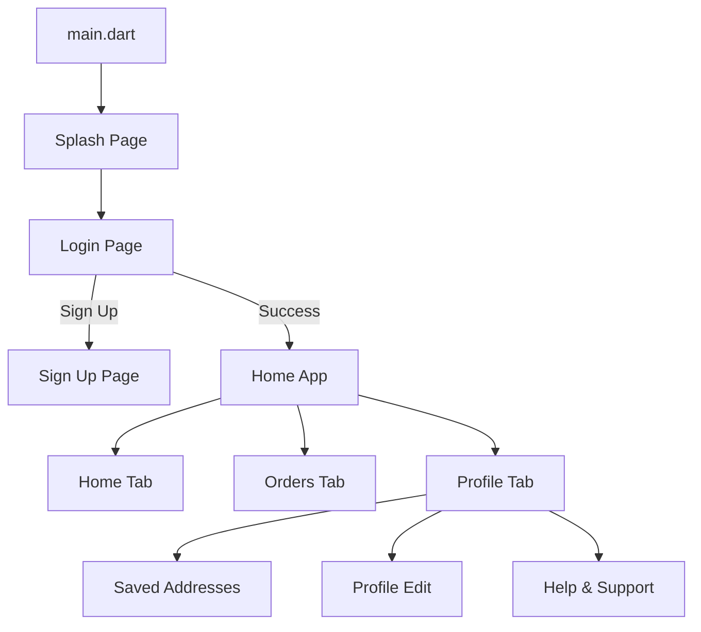

# Application Flow

This document describes the high-level flow of the RapidX mobile application.

## 1. Initial Launch
The application starts at `lib/main.dart`.
- The `newRapidX` widget initializes `ScreenUtil` for responsive design.
- It sets up the `MultiProvider` to inject global state (e.g., `UserDataProvider`).
- The initial route is the **Splash Screen**.

## 2. Onboarding & Authentication
### Splash Screen (`lib/splashPage.dart`)
- Displays the app branding ("Move Anything, Anywhere.").
- Shows the "RapidX" logo.
- Contains a "Let's Start" button that navigates to the **Login Page**.

### Login Page (`lib/Customer/customerLogin.dart`)
- Allows existing users to log in with Email and Password.
- Contains a link to "SignUp" for new users, which navigates to `customerSignup`.
- On successful login (currently simulated with validation), the user is navigated to the **Home App** (`homeApp`).
    - Specifically, `Navigator.pushAndRemoveUntil` is used to clear the navigation stack, preventing the user from going back to the login screen.

### Sign Up Page (`lib/Customer/customerSignup.dart`)
- (Accessible from Login Page)
- Allows new users to create an account.

## 3. Main Application (`lib/mainApp/homeApp/homeApp.dart`)
Once authenticated, the user lands on the `homeApp`. This is the core shell of the application, utilizing a `BottomNavigationBar` to switch between three main sections:

### A. Home Tab
- **Class**: `HomeContent`
- **Features**:
    - Displays a promotional carousel/slider powered by Lottie animations.
    - Shows current location status ("7 mins away", "Current location").
    - Provides quick access to services (implementation details inside `HomeContent`).

### B. Orders Tab
- **Class**: `ordersApp` (`lib/mainApp/ordersApp/ordesApp.dart`)
- **Features**:
    - Manages and displays the user's past and active orders.
    - Likely contains lists of deliveries and tracking information.

### C. Profile Tab
- **Class**: `profileApp` (`lib/mainApp/profileApp/profileApp.dart`)
- **Features**:
    - Displays user information (Avatar, Name).
    - Provides menu options:
        - **Profile**: Edit profile details.
        - **Saved Addresses**: Manage saved locations (leads to `SavedAddressesPage`).
        - **Help & Support**: Access support.
        - **Terms & Conditions**: View legal terms.
        - **About Us**: App information.
        - **Account Settings**: Settings.
        - **Logout**: Logs the user out and returns to the Login Page.

## Navigation Structure

